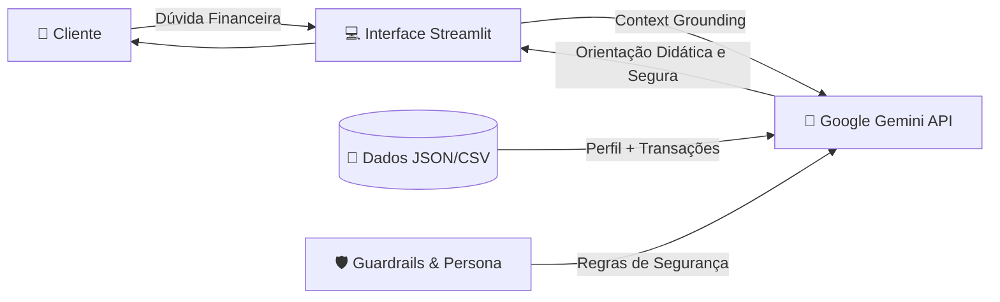

```markdown
# 💰 Braat Finanças - Assistente Virtual com GenAI & Cibersegurança

> **Projeto desenvolvido para o Bootcamp Bradesco - GenAI, Dados & Cyber | DIO.ME**  
> *Desafio: Construa Seu Assistente Virtual Com Inteligência Artificial*

---

## 🎯 Sobre o Projeto

O **Braat Finanças** é um assistente virtual e mentor financeiro pessoal inteligente com arquitetura *Security by Design*. Utilizando a API do **Google Gemini (gemini-3.6-flash)** integrada a uma interface web em **Streamlit**, o agente analisa os dados financeiros reais do cliente para ensinar conceitos de finanças, diagnosticar gastos e planejar a Reserva de Emergência de forma simples, segura e sem "economês".

---

## ✨ Principais Funcionalidades

- 📊 **Diagnóstico Automático de Gastos:** Leitura e categorização das despesas mensais (`transacoes.csv`) identificando maiores impactos no orçamento (Moradia, Alimentação, etc.).
- 🛡️ **Dimensionamento de Reserva de Emergência:** Cálculo personalizado da meta de reserva de acordo com o perfil e regime profissional do cliente (CLT vs Autônomo).
- 🔒 **Guardrails de Cibersegurança & Ética:** 
  - Proibição estrita de indicar investimentos de risco antes da reserva completa.
  - Recusa a promessas de retorno garantido e esquemas milagrosos.
  - Proteção total de privacidade (não solicita nem armazena senhas ou dados bancários).
- 💬 **Linguagem Acessível e Empática:** Explica termos complexos (CDI, Selic, Liquidez, LCI/LCA) através de analogias do dia a dia.

---

## 🏗️ Arquitetura da Solução



---

## 📁 Estrutura do Repositório

```text
├── data/                               # Base de dados do cliente fictício
│   ├── perfil_investidor.json         # Perfil, patrimônio e metas do João Silva
│   ├── transacoes.csv                 # Histórico de receitas e despesas mensais
│   ├── historico_atendimento.csv      # Interações anteriores
│   └── produtos_financeiros.json      # Catálogo oficial de produtos de investimento
│
├── src/                                # Código-fonte da aplicação
│   ├── app.py                         # Aplicação Streamlit com chamada à IA
│   ├── requirements.txt               # Dependências do projeto
│   └── README.md                      # Documentação técnica do código
│
├── AGENTS.md                          # Diretrizes e regras mestras do agente
├── avaliacao.md                       # Casos de teste, métricas de qualidade e resultados
└── README.md                          # Apresentação principal do projeto
```

---

## 🚀 Como Executar o Projeto

### Pré-requisitos
- Python 3.10 ou superior instalado.
- Chave gratuita da API do **Google Gemini** ([Obter no Google AI Studio](https://aistudio.google.com/apikey)).

### Passo a Passo

1. **Clone o repositório:**
   ```bash
   git clone https://github.com/BrunoBraat/dio-lab-bia-do-futuro-desafio-bradesco-braat.git
   cd dio-lab-bia-do-futuro-desafio-bradesco-braat
   ```

2. **Instale as dependências:**
   ```bash
   pip install -r src/requirements.txt
   ```

3. **Inicie a aplicação:**
   ```bash
   streamlit run src/app.py
   ```

4. **Acesse no navegador:**
   - A aplicação abrirá automaticamente em `http://localhost:8501`.
   - Insira sua **Gemini API Key** na barra lateral à esquerda e comece a interagir!

---

## 🛠️ Tecnologias Utilizadas

- **Linguagem:** Python 3.10+
- **Frontend / Interface:** [Streamlit](https://streamlit.io/)
- **Inteligência Artificial:** Google Gemini API (`gemini-3.6-flash`)
- **Manipulação de Dados:** Pandas & JSON
- **Metodologia:** Prompt Engineering (Few-Shot Prompting, Grounding e Guardrails)

---

## 👨‍💻 Autor

Desenvolvido por **Bruno Braat**  
Projeto para o **Bootcamp Bradesco - GenAI, Dados & Cyber** na [DIO](https://dio.me).
```

---
